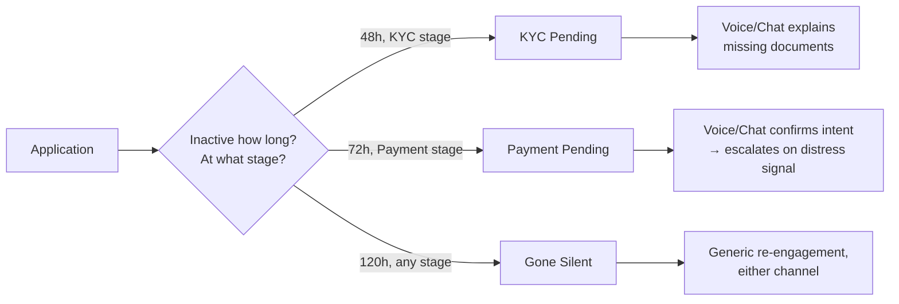
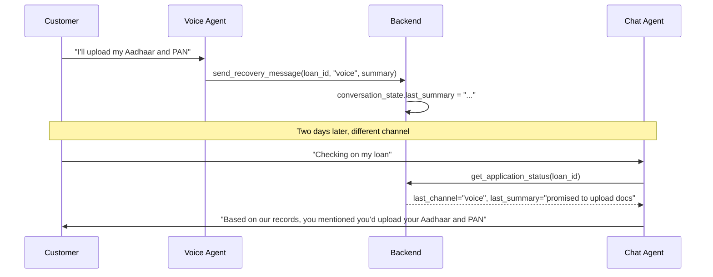

# Floris AI

**An autonomous workflow recovery agent for stalled customer journeys, built on Kipps.AI**

*Submitted to Kipps.AI's "Build for New Age India 2026" Hackathon - Track 03: Support*

## Live deployment

|---|---|
| **Live API** | https://floris-ai.onrender.com |
| **Live Dashboard** | https://floris-ai.onrender.com/dashboard |
| **API Docs (Swagger)** | https://floris-ai.onrender.com/docs |

> The service spins down after 15 minutes of inactivity, so the first request after idle may take 30–60 seconds to wake up. Subsequent requests are instant.

---

## Overview

Businesses lose recoverable revenue every day to stalled customer journeys - an unfinished loan application, a missing document, a payment left pending, a customer who simply goes quiet. Nobody follows up at the right time, on the right channel, with the right context, until it's too late.

**Floris AI** watches for exactly this. It runs a continuous background scan across customer applications, classifies *why* each one has stalled, and re-engages the customer over voice or chat - carrying full conversation context across both channels — before escalating to a human only when the situation genuinely calls for one.

This repository demonstrates the system on a single vertical: **loan application recovery.**

---

## Why this matters (Track 03 alignment)

Kipps.AI's Support track calls for: *"Chat resolution → voice escalation with context. Handle the majority of queries autonomously; escalate only what genuinely needs a human."*

Floris AI implements this directly — a customer can resolve a query through Chat, and if it needs a human, the handoff carries the full conversation history, not just a flag.

---

## System architecture

```mermaid
flowchart TB
    subgraph Detection["Autonomous Detection"]
        SCHED["Background Scheduler<br/>(scans every 5 min)"]
        DB[(PostgreSQL)]
        SCHED -->|classifies stall type| DB
    end

    subgraph Kipps["Kipps.AI Platform"]
        VOICE["Voice Agent"]
        CHAT["Chat Agent"]
        KB["Knowledge Base"]
        WORKFLOW["Outbound Workflow<br/>(Webhook → Phone Call)"]
    end

    subgraph Backend["Floris AI Backend (FastAPI)"]
        API["Function Calling Endpoints"]
        STATE[("conversation_state<br/>shared context")]
        ESC["Escalation Engine"]
        QUEUE[("human_queue")]
        DASH["Live Dashboard"]
    end

    DB --> API
    VOICE <-->|4 documented functions| API
    CHAT <-->|4 documented functions| API
    CHAT <--> KB
    API --> STATE
    STATE -->|context carried across channels| VOICE
    STATE -->|context carried across channels| CHAT
    API --> ESC
    ESC -->|full context on handoff| QUEUE
    DASH --> API
    DASH -->|dispatch call for a stalled lead| WORKFLOW
    WORKFLOW --> VOICE
```



**Backend:** FastAPI + PostgreSQL, deployed on Render
**Platform:** Kipps Voice Agent, Chat Agent, Knowledge Base, Function Calling, Workflow Builder
**Glue:** Kipps agents call our backend through 4 documented Function Calling endpoints; a background scheduler keeps detection running independently of any request or dashboard visit.

---

## The three stall types

| Type | Trigger condition | Recovery behavior |
|---|---|---|
| **KYC Pending** | No document upload 48h after starting | Explains missing documents (Aadhaar/PAN), guides the upload |
| **Payment Pending** | Approved but unpaid 72h later | Confirms intent; escalates **immediately** on any sign of inability to pay — this is compliance-sensitive and does not wait for retry exhaustion |
| **Gone Silent** | No activity for 120h+ (5 days) | Generic, channel-agnostic re-engagement |

Each type drives genuinely different agent behavior — this is not one script reused three times.



---

## Dual-channel context — the core differentiator

Every conversation, on either channel, begins with the agent calling `get_application_status`. This doesn't just return the loan's stage — it returns `last_channel` and `last_summary` from a shared `conversation_state` table that both agents read and write.

**In practice:** a customer explains their situation to the Voice agent. Two days later they open Chat instead. The Chat agent's very first action is to check this table — it already knows what was discussed and continues the conversation instead of starting cold.



This was verified end-to-end during testing — a promise made over Voice was correctly recalled by the Chat agent in a completely separate session.

---

## Escalation design

Two independent triggers — either one alone is sufficient to escalate:

```python
def should_escalate(attempts_made, latest_transcript):
    if attempts_made >= MAX_AUTO_ATTEMPTS:  # retry exhaustion
        return True, "retry_exhaustion"
    if any(
        flag in latest_transcript.lower()  # red-flag keywords
        for flag in RED_FLAG_KEYWORDS
    ):
        return True, "red_flag_keyword"
    return False, None
```

Every escalation writes a **full context record** to `human_queue` — the stall type, what was already tried, and exactly why it escalated. Whoever picks it up doesn't start from zero.

---

## Function Calling endpoints

The four functions Kipps' Voice and Chat agents call into:

| Endpoint | Method | Purpose |
|---|---|---|
| `/applications/status` | `GET` | Fetch stage, stall type, and shared context before responding |
| `/send_recovery_message` | `POST` | Log a contact attempt; auto-checks retry-exhaustion escalation |
| `/escalate` | `POST` | Hand off to the human queue with full context |
| `/log_channel_switch` | `POST` | Record a Voice ↔ Chat transition, preserving continuity |

Loan ID lookups are normalized before querying, since voice transcription of IDs is inconsistent — `"1001"`, `"loan_1001"`, and `"LOAN-1001"` all resolve to the same record.

---

## Autonomous detection

A background scheduler (`APScheduler`) runs a full stall-classification scan every 5 minutes, independent of any dashboard visit or agent request. The system knows about a new stall before anyone thinks to check.

---

## Outbound call dispatch

The live dashboard includes a **Call** action against each stalled application. This is wired through Kipps' own **Workflow Builder** — an `API/Webhook` trigger node connected to a `Phone Call` action node, configured against the Loan Recovery Voice Agent and a dedicated outbound number.

When the backend posts a lead's contact details to the workflow's webhook, Kipps dispatches the outbound call automatically — no manual dialing, no manual audience management. This was tested and confirmed working end-to-end: a real call was placed, answered, and the agent correctly reported the application's status using live backend data.

---

## Edge cases handled

- **Do-not-disturb hours** — no outbound contact between 8 PM and 9 AM (`app/services/edge_cases.py`)
- **Opt-out respect** — a `do_not_contact` flag permanently excludes an application from scanning and contact
- **Duplicate-contact lock** — an application already `CONTACTED` cannot receive a second simultaneous attempt
- **Retry cap** — a maximum of 2 automated attempts before escalation is mandatory

---

## Project structure

```
floris-ai/
├── app/
│   ├── main.py                     # Entrypoint — wires routers, starts the scheduler
│   ├── core/
│   │   ├── config.py                 # Environment/config, single source of truth
│   │   └── constants.py              # Thresholds, DND hours, red-flag keywords
│   ├── db/                           # SQLAlchemy engine, session, declarative base
│   ├── models/                       # applications, conversation_state, human_queue
│   ├── schemas/                      # Pydantic request/response contracts
│   ├── services/
│   │   ├── stall_detector.py         # classify_stall() — the classification rules
│   │   ├── escalation.py             # should_escalate() — the two-trigger logic
│   │   ├── edge_cases.py             # DND / duplicate-lock checks
│   │   ├── scheduler.py              # Autonomous 5-minute background scan
│   │   └── kipps_client.py           # Outbound workflow dispatch
│   ├── api/routes/                   # applications, actions, dashboard
│   └── templates/dashboard.html      # Live status table + per-lead call trigger
├── scripts/
│   ├── init_db.py                    # Creates all tables
│   └── seed_data.py                  # Seeded applications across all 3 stall types
├── tests/                            # Unit tests — escalation logic + edge cases
└── requirements.txt
```

---

## Running it locally

```bash
python -m venv venv
venv\Scripts\activate              # Windows
pip install -r requirements.txt

copy .env.example .env             # fill in your DB and Kipps credentials

python scripts/init_db.py
python scripts/seed_data.py

uvicorn app.main:app --reload
```

`/docs` for the API reference, `/dashboard` for live status and call dispatch.

---

## Acknowledgments

Built on the **Kipps.AI** platform — Voice Agent, Chat Agent, Knowledge Base, Function Calling, and Workflow Builder made this possible without building telephony or speech infrastructure from scratch. Thank you to the Kipps.AI team for hosting this hackathon and for a platform flexible enough to support a genuinely autonomous, dual-channel recovery workflow.

---

## Author

**Udit Navariya**
Solo build — Kipps.AI "Build for New Age India 2026" Hackathon, Track 03 (Support)